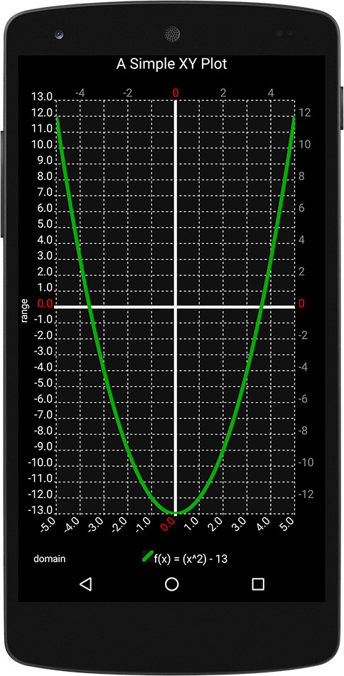
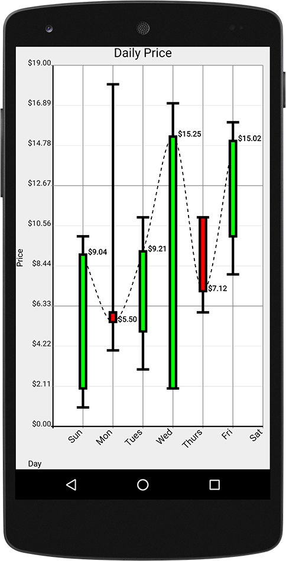
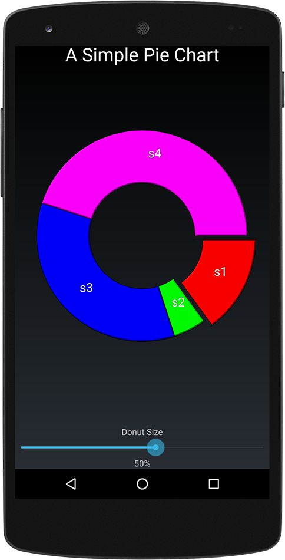
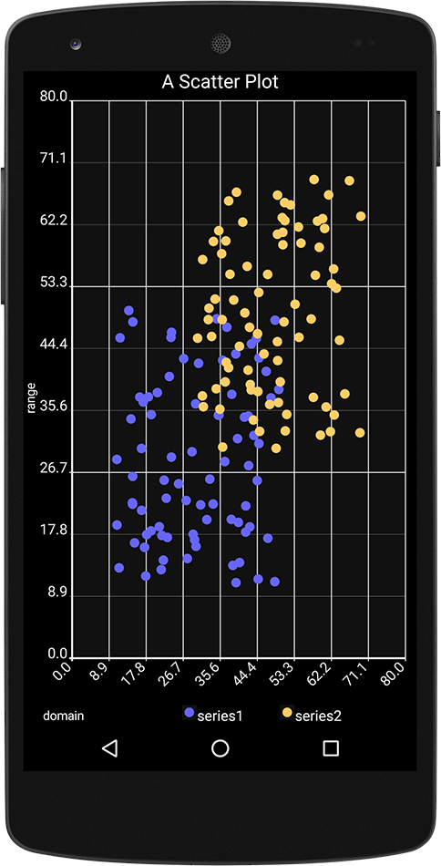
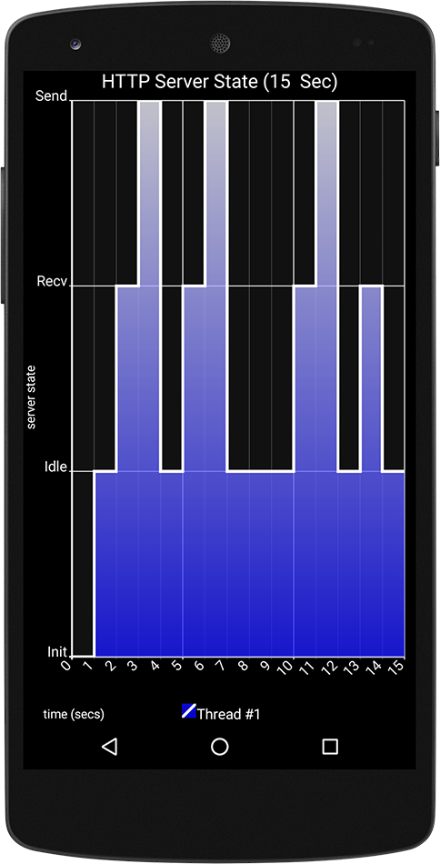
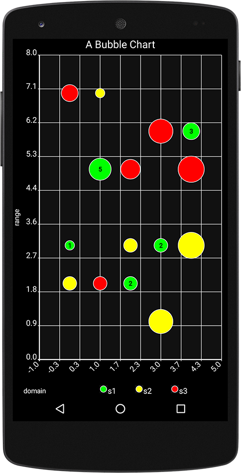
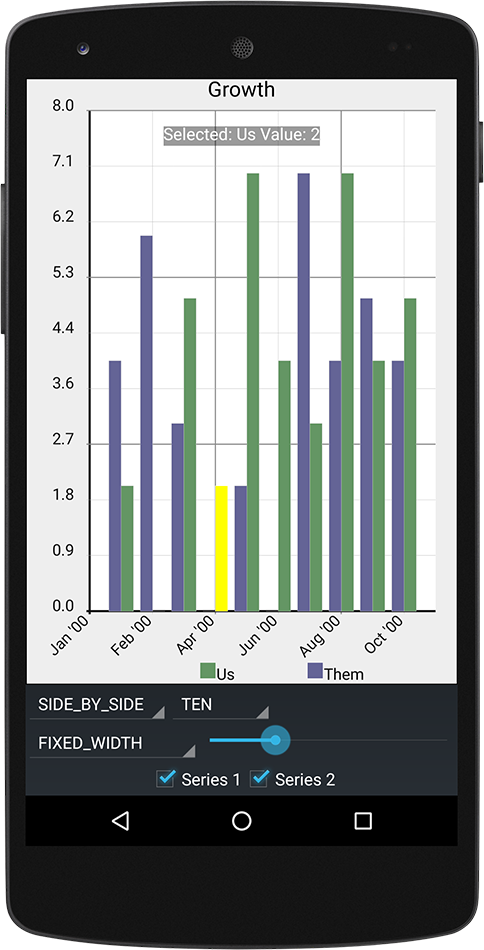

#  Androidplot [](https://central.sonatype.com/artifact/com.androidplot/androidplot-core) [](https://www.appbrain.com/stats/libraries/details/androidplot/androidplot) [](https://codix.io/gh/repo/halfhp/androidplot) [](https://codecov.io/gh/halfhp/androidplot) [](https://twitter.com/androidplot)

A library for creating dynamic and static charts in Android apps.

Androidplot runs on Android 2.0 (API 5) and up, works equally well from Kotlin and Java, and can be
used from Jetpack Compose via `AndroidView`.

If you enjoy the lib, please [rate us on codix.io](https://codix.io/gh/repo/halfhp/androidplot)!

      

**Features:**

* Line Charts
* Scatter Charts
* Bar Charts
* Pie Charts
* Step Charts
* Candlestick Charts
* Bubble Charts
* Dynamic plots
* Pan & Zoom
* Background-thread rendering
* Large datasets (automatic downsampling)
* Value markers & shaded regions
* XML styling & custom renderers

# Getting Started

```groovy
dependencies {
    implementation "com.androidplot:androidplot-core:1.5.11"
}
```

Then follow the **[Quickstart](docs/quickstart.md)** :star: to get your first plot on screen, or dive into
the [full documentation](docs/index.md).  Every push to master also publishes a
[snapshot build](docs/quickstart.md#add-the-dependency) if you want to try unreleased changes.

# Demo App

The demo app showcases every plot type and feature, and its source is the best reference for how
things fit together:

* [Install it from Google Play](https://play.google.com/store/apps/details?id=com.androidplot.demos)
* [Browse the source](demoapp/src/main/java/com/androidplot/demos)

# Links

* [Website](http://androidplot.com)
* :movie_camera: [Watch Androidplot get a cavity check at Google I/O 2018](https://www.youtube.com/watch?v=x9T5EYE-QWQ),
  where it stars in *Effective ProGuard keep rules for smaller applications*
* [Bugs](https://github.com/halfhp/androidplot/issues) :ant:
* [Release Notes](docs/release_notes.md)
* [Contributing Source Code](docs/contributing.md)

# Help
Technical questions should be posted using the [androidplot tag](http://stackoverflow.com/questions/tagged/androidplot) on Stack Overflow.  For everything else use the [Google Groups forum](https://groups.google.com/d/forum/androidplot).

# License
Androidplot has been made available under the Apache 2.0 license. Source files carry an
[SPDX](https://spdx.dev/learn/handling-license-info/) `SPDX-License-Identifier: Apache-2.0` tag
in place of a full license header; the full text is in [LICENSE.md](LICENSE.md).

    Copyright 2026 Androidplot.com

    Licensed under the Apache License, Version 2.0 (the "License");
    you may not use this file except in compliance with the License.
    You may obtain a copy of the License at

        http://www.apache.org/licenses/LICENSE-2.0

    Unless required by applicable law or agreed to in writing, software
    distributed under the License is distributed on an "AS IS" BASIS,
    WITHOUT WARRANTIES OR CONDITIONS OF ANY KIND, either express or implied.
    See the License for the specific language governing permissions and
    limitations under the License.
