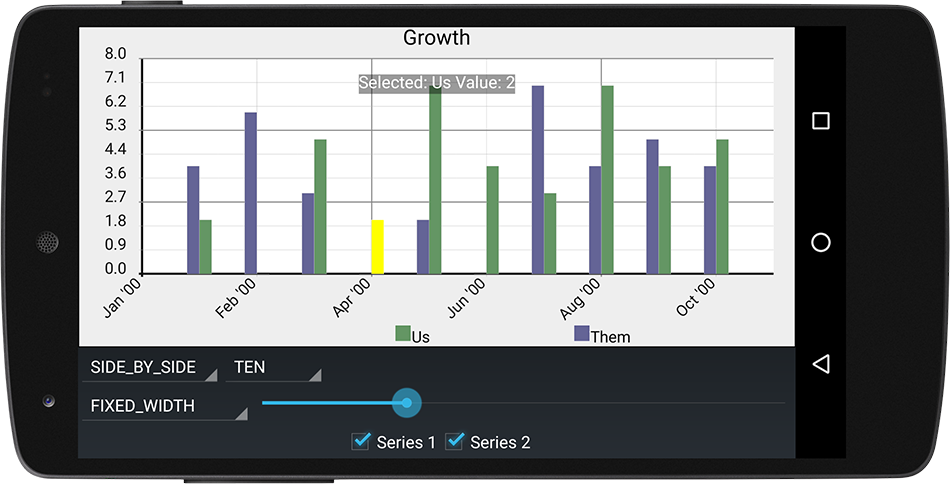
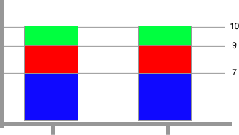
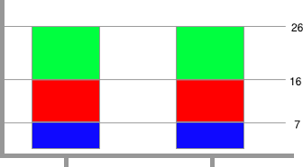
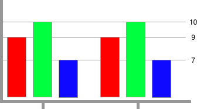
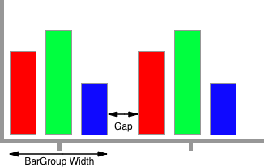

# Bar Charts
Bar Charts are drawn with `BarRenderer` by converting xy values of an `XYSeries` into
vertical bars.  The height of the vertical bar is calculated from the yVal and the base
of the bar is calculated from the plot's range origin value.



# Basic Usage
Rendering an `XYSeries` as a bar chart is as simple as adding the series to an `XYPlot` with an 
instance of `BarFormatter`:

```java
// create a bar formatter with a red fill color and a white outline:
BarFormatter bf = new BarFormatter(Color.RED, Color.WHITE);
plot.addSeries(series, bf);
```

# BarRenderer
Unlike most other renderers, much of the visual configuration of a bar chart is configured through it's `BarRenderer`.
`BarRenderer` provides methods for setting how the width of each bar should be calculated, the space between each `Bar`
and what style of visual grouping to use.


##### Getting the BarRenderer Instance
Many of the topics below require access to the `BarRenderer` instance to be set.  Each instance of 
`XYPlot` contains it's own unique `Renderer` instances.  To retrieve the `BarRenderer` 
instance from an `XYPlot`:

```java
BarRenderer renderer = plot.getRenderer(BarRenderer.class);
```

# BarGroup
A `BarGroup` is automatically generated to group values from one or more series by their index values.
All `Bar` instances belong to a `BarGroup`, even if there is only a single `XYSeries` that exists.

A common use case of bar charts is to represent a group of two or more values for a given interval as
individual bars, for example the number of wins and losses for a baseball team for every month over the course
of a year.

To model this in Androidplot, create two instances of `XYSeries`; one for wins and one for losses, each
with exactly 12 elements (one for each day of the month):

```java
XYSeries wins = new SimpleXYSeries(SimpleXYSeries.ArrayFormat.Y_VALS_ONLY, "wins", 3, 4, 5, 3, 2, 3, 5, 6, 2, 1, 3, 1);
XYSeries losses = new SimpleXYSeries(SimpleXYSeries.ArrayFormat.Y_VALS_ONLY, "losses", 0, 1, 1, 0, 1, 0, 0, 0, 2, 1, 0, 1);
```

Each series is then added to the plot with it's own formatter:

```java
// draw wins bars with a green fill:
BarFormatter winsFormatter = new BarFormatter(Color.GREEN, Color.BLACK);
plot.addSeries(wins, winsFormatter);

// draw losses bars with a red fill:
BarFormatter lossesFormatter = new BarFormatter(Color.RED, Color.BLACK);
plot.addSeries(losses, lossesFormatter);
```

The pairs of wins/losses bars are then drawn side-by-side for each of the 12 indexes.  Androidplot
knows to do this because `BarRenderer` (the renderer used to draw series associated with a `BarFormatter`) 
extends [GroupRenderer](grouprenderer.md).

# BarRenderer Styles
`BarRenderer` provides three grouping styles that may be used when rendering two or more XYSeries:
`OVERLAID`, `STACKED`, `SIDE_BY_SIDE`

##### OVERLAID (default) 
Bars in the same grouping are overlaid on each-other, the bars being drawn by yVal in descending order.




To use:
```java
barRenderer.setBarOrientation(BarRenderer.BarOrientation.OVERLAID);
```

##### STACKED
Bars in the same group are stacked on top of each-other.  Limitations:
* Range Origin must be set to 0.
* All `XYSeries` must contain no negative values.



To use:
```java
barRenderer.setBarOrientation(BarRenderer.BarOrientation.STACKED);
```

##### SIDE_BY_SIDE
Bars in the same group are drawn next to one another.



To use:
```java
barRenderer.setBarOrientation(BarRenderer.BarOrientation.SIDE_BY_SIDE);
```

By default there is no spacing between bars in the same `BarGroup` in this mode.  You can add spacing
by setting a left and right margin on your BarFormatter instances:

```java
barFormatter.setMarginLeft(PixelUtils.dpToPix(1));
barFormatter.setMarginRight(PixelUtils.dpToPix(1));
```

# BarGroup Widths & Spacing
When configuring BarGroup widths and spacing, there are two mutually exclusive methods that can be used;
`FIXED_WIDTH` and `FIXED_GAP`.



##### FIXED_WIDTH
The exact size of the `BarGroup` is specified in pixels and the space between each `BarGroup`
is dynamically calculated based on that size.

```java
barRenderer.setBarWidth(BarRenderer.BarGroupWidthMode.FIXED_WIDTH, PixelUtils.dpToPix(25));
```
##### FIXED_GAP
The exact size of the "gap" between each `BarGroup` is specified in pixels and the size of each `BarGroup`
is dynamically calculated based on that spacing.

```java
barRenderer.setBarWidth(BarRenderer.BarGroupWidthMode.FIXED_GAP, PixelUtils.dpToPix(5));
```

# Example
See the DemoApp's [bar chart example source](../demoapp/src/main/java/com/androidplot/demos/BarPlotExampleActivity.java).