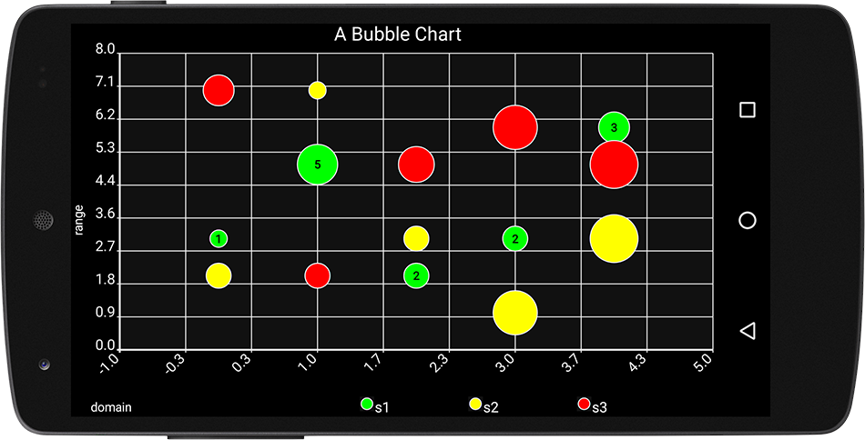

# Bubble Charts
A `BubbleChart` is a two dimensional representation of three dimensional data
on an `XYPlot`, where the xy values are drawn as a circle with a radius representing the zVal.



# Basic Usage
The first step in creating a `BubbleChart` is to define the data to be plotted.  We'll start
by creating an instance of `BubbleSeries`:

Using the implicit iVal for x:

```java
BubbleSeries series1 = new BubbleSeries(
    Arrays.asList(new Number[]{3, 5, 2, 3, 6}),        // xCoordinate
    Arrays.asList(new Number[]{1, 5, 2, 2, 3}), "s1"); // yCoordinate
```

Or it's equivalent four argument counterpart:

```java
BubbleSeries bubbleSeries = new BubbleSeries(
    Arrays.asList(new Number[]{0, 1, 2, 3, 4}),        // xCoordinate
    Arrays.asList(new Number[]{3, 5, 2, 3, 6}),        // yCoordinate
    Arrays.asList(new Number[]{1, 5, 2, 2, 3}),        // zVal (corresponds to radius) 
    "s1");
```

Next, create a `Formatter` defining the fill and outline colors of the bubbles:


```java
// draw bubbles with a green fill and white outline:
BubbleFormatter formatter = new BubbleFormatter(Color.GREEN, Color.WHITE)
```

Finally, add the `BubbleSeries` to our plot as you would any other `XYSeries` instance:

```java
plot.addSeries(bubbleSeries, formatter);
```

# BubbleScaleMode
By default, `BubbleRenderer` scales each rendered bubble radius using the square root  of it's corresponding
zVal, preventing apparent size differences in each bubble radius from being visually misleading.  See: https://en.wikipedia.org/wiki/Bubble_chart#Choosing_bubble_sizes_correctly

If you'd prefer to use a linear scale:

```java
plot.getRenderer(BubbleRenderer.class).setBubbleScaleMode(BubbleRenderer.BubbleScaleMode.LINEAR);
```
# Example
Check out the [bubble chart example source](../demoapp/src/main/java/com/androidplot/demos/BubbleChartActivity.java) for a full source example of a bubble chart.
