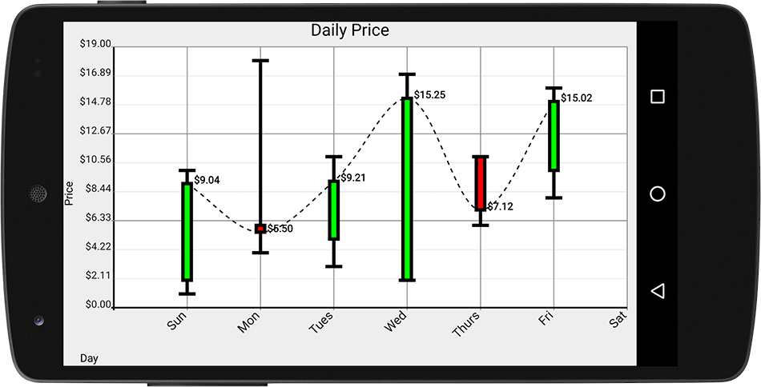

# Candlestick Charts
Candlestick charts are a special kind of `XYPlot` usually used for rendering financial information.
Each "candlestick" is composed of 4 values: open, close, high and low.



Androidplot's implementation of candlestick charts uses four separate `XYSeries` instances to represent 
the candlestick values; each series corresponds to one of the four values that composes each "candlestick".

For example:

```java
Number[] highVals = new Number[] {12, 10, 15, 8, 7};
Number[] lowVals = new Number[] {3, 1, 5, 0, 2};
Number[] openVals = new Number[] {5, 2, 7, 5, 3};
Number[] closeVals = new Number[] {7, 9, 6, 0, 4};
```

Using the values above, the first candlestick model would be `{high=12, low=3, open=5, close=7}`, 
the second would be `{high=10, low=1, open=2, close=7}` and so on.

There are a few constraints that must be satisfied before we can create XYSeries from the data above and add them to Androidplot:

* Each series must be of the same size.
* Each series must have the same x(i); getX(i) must return the same value for each series.
* There must be exactly four series, added in the precise order: high, low, open, close.
* The series data must make sense; each candlestick's high must be equal to or greater than all other 
values in the candlestick, and each candlestick's low must be less than or equal to all other values.
* Each candlestick series belonging to the same candlestick chart must use the same `CandlestickFormatter` 
instance when being added to the XYPlot.

While it's possible to satisfy these constraints by creating each of the four `XYSeries` required by a 
candlestick chart, adding them in order using the same formatter, many projects will find it simpler 
to interact with the data as though it were a single series of candlestick values.  To makr this easier, 
two convenience classes: `CandlestickSeries` and `CandlestickMaker`. Here's how they are used together to add a candlestick chart to an `XYPlot`:

```java
CandlestickSeries candlestickSeries = new CandlestickSeries(
    new CandlestickSeries.Item(1, 10, 2, 9),
    new CandlestickSeries.Item(4, 18, 6, 5),
    new CandlestickSeries.Item(3, 11, 5, 10),
    new CandlestickSeries.Item(2, 17, 2, 15),
    new CandlestickSeries.Item(6, 11, 11, 7),
    new CandlestickSeries.Item(8, 16, 10, 15));

CandlestickFormatter formatter = new CandlestickFormatter();

// add the candlestick series data to the plot:
CandlestickMaker.make(plot, formatter, candlestickSeries);
```

It's necessary to use `CandlestickMaker` to add the `CandlestickSeries` (via "make") to the 
`XYPlot` as `CandlestickSeries` does not and cannot implement the `XYSeries` interface.


[A full source example is available here](../demoapp/src/main/java/com/androidplot/demos/CandlestickChartActivity.java).


