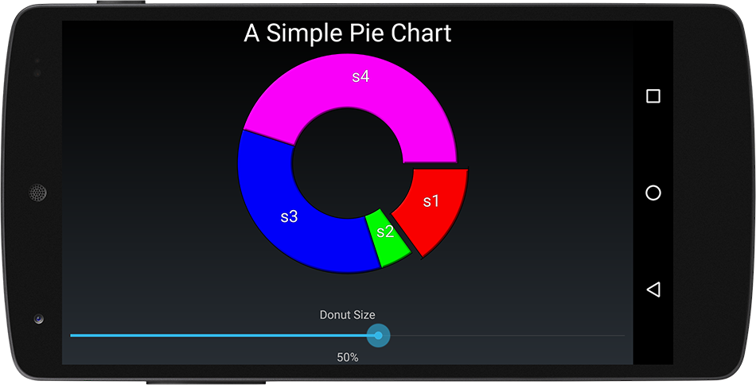
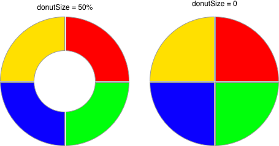
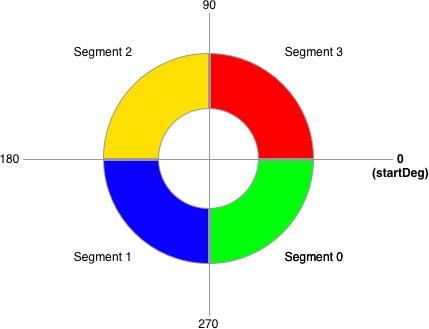
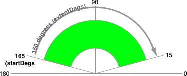
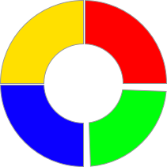
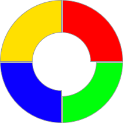
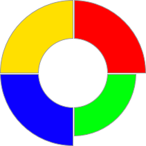

# Pie Charts
Like all other primary chart and graph classes in Androidplot, `PieChart` is simply a composition
of widgets along with convenience methods.  The real work is actually done by `PieWidget`.



# Basic Usage
Pie charts are composed of one or more values called Segments which combines a vaue and a label:

```java
Segment segment = new Segment("my segment", 10);
```

Displaying a `Segment` to a pie chart also requires a `SegmentFormatter`.  `SegmentFormatter` is what defines
the visual characteristics of the associated `Segment`; color, border thickness, 
segment offset, label text style (if any) etc.  The below code instantiates a new `SegmentFormatter`
with a segment color of red:

```java
SegmentFormatter formatter = new SegmentFormatter(Color.RED);
```

Finally, the `Segment` must be added to the pie chart along with it's `SegmentFormatter`:

```java
pie.addSegment(segment, formatter);
```

# Donut Size
By default, `PieChart` draws it's self as a ring.  The amount of empty space in the middle of
the pie is called the `donutSize`.  Setting a `donutSize` of 0 causes the `PieChart` to draw it's 
self as a full circle.



Setting `donutSize` programmatically:

```java
// draw pie with an empty inner space radius equal to 50% of the pie's radius.
pieRenderer.setDonutSize(0.5, PieRenderer.DonutMode.PERCENT);

// donut size may also be expressed in pixels:
pieRenderer.setDonutSize(PixelUtils.dpToPix(30), PieRenderer.DonutMode.PIXELS);
```

# Segment Orientation
Each `Segment` is drawn in the order it was added to the `PieChart` clockwise from `startDegs` 
which by default is 0.



Using the image above, to move Segment0 to the Northeast quadrant
of the pie (currently occupied by Segment3) `startDeg` should be set to 90:

```java
pie.getRenderer(PieRenderer.class).setStartDegs(90);
```
# Extent
The `extentDegs` value determines the number of degrees running clockwise from `startDegs` that 
represent 100% of the pie chart.  The formal description is a little obtuse but is easy to understand 
through example.  You could for instance use `extentDegs` in conjunction with `startDegs` to represent 
the full pie as a gauge:

```java
// start the first segment at 5 degrees;
pie.getRenderer(PieRenderer.class).setStartDegs(165);
pie.getRenderer(PieRenderer.class).setExtentDegs(150);
```
Which produces a pie chart profile like this:



# SegmentFormatter
As mentioned above, `SegmentFormatter` defines how a `Segment` is visually represented in a `PieChart`.
In addition to basic color / border line styling params, there are several parameters available
to visually distinguish a segment:

## Offset
Value in pixels used to "shift" the position of the segment outward relative to the center of the `PieChart`.
The visual effect is equivalent to cutting up a pie and dragging one piece out and away from the rest of the pie:


## RadialInset
Value in degrees used to shrink the radial edges of the segment inward.  The visual effect is equivalent
to shaving the edges off of a slice of pie, resulting in a narrower slice of pie:



## InnerInset
Value in pixels used to shrink the inner section of the pie.  The visual effect is equivalent to
cutting the tip off of a slice of pie:



## OuterInset
Value in pixels used to shrink the outer edge of the pie.  The visual effect is equivalent to evenly
shaving the crust off of a slice of pie:



See the DemoApp's 
[pie chart example source](../demoapp/src/main/java/com/androidplot/demos/SimplePieChartActivity.java) for a comprehensive usage example.

