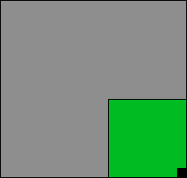
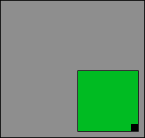
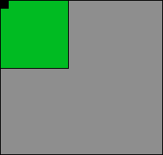
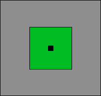
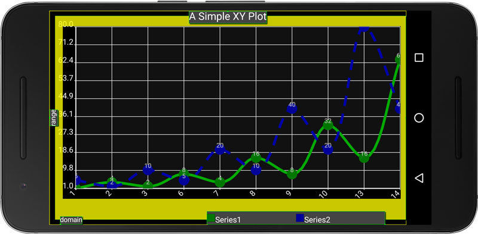

# Plot Composition
All plots in Androidplot inherit from the abstract base class Plot which provides common behaviors
for all Plot implementations.

# Widgets
Plots are composed of one or more Widgets.  A Widget is an abstraction of a visual
component that may be positioned and scaled within the visible area of a Plot.  For example,
an XY Plot is typically composed of these 5 Widgets:

* Title
* Graph
* Domain Label
* Range Label
* Legend

All Plot implementations will contain at least one default Widget providing the core
behavior encapsulated by that Plot.  In addition to moving and scaling these Widgets, developers may
also extend them and replace the Plot's default instance with the derived implenentation in order to 
get custom behavior.

Internally, an instance of LayoutManager is used by Plot to manage it's Widgets.

# The LayoutManager
The LayoutManager provides the logic for visually positioning and scaling Widgets.  

## Z-Indexing
Z-indexing is a 2D drawing concept which associates each drawable entity with a value that determines
which elements get drawn onto the screen first, producing the visual effect that certain elements appear
on top of others.

While Androidplot uses the term "z-index" it's implemented internally as a linked list to prevent the possibility
of duplicate index values and therefore ensuring that the drawing order of Widgets is always explicit.
The [Layerable](../androidplot-core/src/main/java/com/androidplot/util/Layerable.java) interface 
defines methods used for manipulating the z-index of a Widget.

## Adding & Removing Widgets
New Widgets can be added either to the front or back of the z-index using these methods:

* `LayoutManager.addToTop(Widget)`
* `LayoutManager.addToBottom(Widget)`

## Positioning Widgets
Once a Widget has been added to the LayoutManager, it's position within the Plot can be adjusted via
`Widget.position(...)`. This method takes a layout style and value for the x and y dimension and an
optional anchor position from which the layout modes will be applied.

### HorizontalPosition & VerticalPosition
These define the part of the Plot from which Widget will be positioned using relative or absolute units.   

* XPosition - Supports positioning in relation to the Plot's left edge, right edge or horizontal center.
* YPosition - Supports positioning in relation to the Plot's top edge, bottom edge or vertical center.


#### Absolute Positioning
Absolute positioning means that positions are expressed as an absolute pixel offset from the specified 
edge or center point. 

#### Relative Positioning
Relative positions are expressed as a ratio of the total size of the Plot along the given axis.  This
ration must fall within the range of -1 to 1.

**Example #1: A relative XPosition of 1 and YPosition of 0.5 in a 100Hx200W pixel Plot**

x = 1 * 200 = 200

y = 0.5 * 100 = 50

**Example #2: An absolute XPosition of 50 and an absolute YPosition of 25 in a 100Hx200W pixel Plot**

x = 50

y = 25

#### Anchors
The Anchor param specifies the point on the Widget from which the XPosition and YPosition calculations will be applied.
Using example #1 above, an Anchor value of `Anchor.LEFT_TOP` means that  the top left corner of the Widget
would be positioned at the screen coordinate [200, 50].

#### Examples
```xml
ap:graphAnchor="right_bottom"
ap:graphHorizontalPositioning="absolute_from_right"
ap:graphHorizontalPosition="0dp"
ap:graphVerticalPositioning="relative_from_bottom"
ap:graphVerticalPosition="0dp"
```

***
```xml
ap:graphAnchor="right_bottom"
ap:graphHorizontalPositioning="absolute_from_right"
ap:graphHorizontalPosition="10dp"
ap:graphVerticalPositioning="relative_from_bottom"
ap:graphVerticalPosition="10dp"
```

***
```xml
ap:graphAnchor="right_bottom"
ap:graphHorizontalPositioning="absolute_from_left"
ap:graphHorizontalPosition="0dp"
ap:graphVerticalPositioning="relative_from_top"
ap:graphVerticalPosition="0dp"
```

***
```xml
ap:graphAnchor="center"
ap:graphHorizontalPositioning="absolute_from_center"
ap:graphHorizontalPosition="0dp"
ap:graphVerticalPositioning="absolute_from_center"
ap:graphVerticalPosition="0dp"
```



## Scaling Widgets
TODO

### SizeMetric
TODO

#### Examples
TODO

## Margins and Padding
Every widget has a margin, padding and an optional border that can be drawn around it.  These params behave 
very similarly to those defined in the [CSS Box Model](http://www.w3schools.com/css/css_boxmodel.asp).

## Markup Mode.
If you're having trouble visualizing the effects of tweaking margins and padding, you can enable
markup mode which will highlight these spaces on each widget, as well as draw a green line around it's
absolute border.  

To turn markup mode on for a plot programmatically:

```java
plot.setMarkupEnabled(true);
```

Or via XML:

```xml
ap:markupEnabled="true"
```

This is what it looks like:



# Formatters, Renderers and Series Data
Each Plot specifies the type of Series it supports; XYPlots support XYSeries, PieCharts support Segment, etc.
In all cases, the Series encapsulates the numeric model of the data being represented by the Plot.

## Formatters 
The Plot keeps a mapping between Series 
data and the Formatter instance provided by the user that is to be used to render that data.  It is the
Formatter that tells Androiplot which Renderer to use to draw the Series along with which colors, line thicknesses,
text style, etc. to apply while drawing.

## Renderers
The Renderer is what renders Series data onto a Plot.  Users can provide their own custom rendering behavior
by writing their own Renderer implementation along with a custom Formatter telling Androidplot about the
Renderer via the `Formatter.getRendererClass()` method.

# XML Styling
Androidplot supports an increasing number of XML attributes.  The two best resources for learning about
these attributes is the [demo app source code](../demoapp) and [attrs.xml](../androidplot-core/src/main/res/values/attrs.xml) file which
contains the exhaustive list of available attributes.