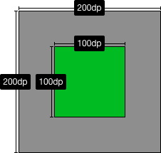
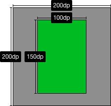
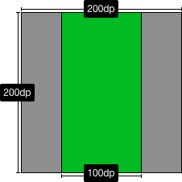
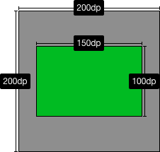
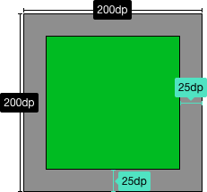

# Plot Composition
All plots in Androidplot inherit from the abstract base class `Plot` which provides common behaviors
for all `Plot` implementations.

# Widgets
Plots are composed of one or more Widgets.  A `Widget` is an abstraction of a visual
component that may be positioned and scaled within the visible area of a Plot.  For example,
an `XYPlot` is typically composed of these 5 `Widgets`:

* Title
* Graph
* Domain Label
* Range Label
* [Legend](legend.md)

All implementations of `Plot` will contain at least one default `Widget` providing the core
behavior encapsulated by that `Plot`.  In addition to moving and scaling a `Widget`, developers may
also extend them and replace the `Plot` instance's default instance with the derived implementation in order to 
get custom behavior.

# The LayoutManager
The `LayoutManager` provides the logic for visually positioning and scaling Widgets; all `Plot` implementations
contain an instance of `LayoutManager` that can be retrieved via `Plot.getLayoutManager()`.

## Z-Indexing
Z-indexing is a 2D drawing concept which associates each drawable entity with a value that determines
which elements get drawn onto the screen first, producing the visual effect that certain elements appear
on top of others.

While Androidplot uses the term "z-index" it's implemented internally as a linked list to prevent the possibility
of duplicate index values and therefore ensuring that `Widget` drawing order is always explicit.
The [Layerable](../androidplot-core/src/main/java/com/androidplot/util/Layerable.java) interface 
defines methods used for manipulating the z-index of a `Widget`.

## Adding & Removing Widgets
New `Widget` instances can be added either to the front or back of the z-index using these methods:

* `LayoutManager.addToTop(Widget)`
* `LayoutManager.addToBottom(Widget)`

## Positioning Widgets
Once a Widget has been added to the LayoutManager, it's position within the Plot can be adjusted via
`Widget.position(...)`. This method takes a layout style and value for the x and y dimension and an
optional anchor position from which the layout modes will be applied.

### HorizontalPosition & VerticalPosition
These define the part of the Plot from which Widget will be positioned using relative or absolute units.   

* XPosition - Supports positioning in relation to the Plot's left edge, right edge or horizontal center.
* YPosition - Supports positioning in relation to the Plot's top edge, bottom edge or vertical center.


#### Absolute Positioning
Absolute positioning means that positions are expressed as an absolute pixel offset from the specified 
edge or center point. 

#### Relative Positioning
Relative positions are expressed as a ratio of the total size of the Plot along the given axis.  This
ration must fall within the range of -1 to 1.

**Example #1: A relative XPosition of 1 and YPosition of 0.5 in a 100Hx200W pixel Plot**

x = 1 * 200 = 200

y = 0.5 * 100 = 50

**Example #2: An absolute XPosition of 50 and an absolute YPosition of 25 in a 100Hx200W pixel Plot**

x = 50

y = 25

#### Anchors
The Anchor param specifies the point on the Widget from which the XPosition and YPosition calculations will be applied.
Using example #1 above, an Anchor value of `Anchor.LEFT_TOP` means that  the top left corner of the Widget
would be positioned at the screen coordinate [200, 50].

#### Examples
The examples below illustrate positioning an `XYGraphWidget` of an `XYPlot`.

xml:
```xml
ap:graphAnchor="right_bottom"
ap:graphHorizontalPositioning="absolute_from_right"
ap:graphHorizontalPosition="0dp"
ap:graphVerticalPositioning="relative_from_bottom"
ap:graphVerticalPosition="0dp"
```
java:
```java
plot.getGraph().position(
        0, HorizontalPositioning.ABSOLUTE_FROM_RIGHT,
        0, VerticalPositioning.RELATIVE_TO_BOTTOM);
```

***

xml:
```xml
ap:graphAnchor="right_bottom"
ap:graphHorizontalPositioning="absolute_from_right"
ap:graphHorizontalPosition="10dp"
ap:graphVerticalPositioning="relative_from_bottom"
ap:graphVerticalPosition="10dp"
```
java:
```java
plot.getGraph().position(
        PixelUtils.dpToPix(10), HorizontalPositioning.ABSOLUTE_FROM_RIGHT,
        PixelUtils.dpToPix(10), VerticalPositioning.RELATIVE_TO_BOTTOM);
```

***

xml:
```xml
ap:graphAnchor="right_bottom"
ap:graphHorizontalPositioning="absolute_from_left"
ap:graphHorizontalPosition="0dp"
ap:graphVerticalPositioning="relative_from_top"
ap:graphVerticalPosition="0dp"
```
java:
```java
plot.getGraph().position(
        0, HorizontalPositioning.ABSOLUTE_FROM_LEFT,
        0, VerticalPositioning.RELATIVE_TO_TOP);
```

***

xml:
```xml
ap:graphAnchor="center"
ap:graphHorizontalPositioning="absolute_from_center"
ap:graphHorizontalPosition="0dp"
ap:graphVerticalPositioning="absolute_from_center"
ap:graphVerticalPosition="0dp"
```
java:
```java
plot.getGraph().position(
        0, HorizontalPositioning.ABSOLUTE_FROM_CENTER,
        0, VerticalPositioning.ABSOLUTE_FROM_CENTER);
```


## Sizing Widgets
The size and shape of a `Widget` is controlled by it's `setSize(Size)` method.

### Size
The `Size` parameter of `Widget.setSize(Size)` defines the height and width of the associated Widget.
It is composed of two `SizeMetric` instances; one for height and one for width.
`Size` provides two constructors: `Size(SizeMetric, SizeMetric)` or
`Size(int, SizeMode, int, SizeMode)`.  Constructor params represent height and width respectively.

### SizeMetric
A `SizeMetric` is composed of a `SizeMode` and a float value.  There are three kinds of `SizeMode`:

* ABSOLUTE - float value defines the size metric as an absolute value in pixels.
* RELATIVE - float value defines the size of the metric relative to the size of the containing Plot along
the associated axis, in the range of 0.0 to 1.0.
* FILL - float value defines an absolute value in pixels to subtract from the size of the containing 
Plot along the associated axis and the SizeMetric "fills" the difference.

#### Examples
The examples below illustrate positioning an `XYGraphWidget` of an `XYPlot` and
assume centered positioning is applied as described in the [Positioning Widgets](#positioning-widgets) section above.

xml:
```xml
ap:graphHeightMode="absolute"
ap:graphHeight="100dp"
ap:graphWidthMode="absolute"
ap:graphWidth="100dp"
```
java:
```java
plot.getGraph().setSize(new Size(
        PixelUtils.dpToPix(100), SizeMode.ABSOLUTE,
        PixelUtils.dpToPix(100), SizeMode.ABSOLUTE));
```

***
xml:
```xml
ap:graphHeightMode="absolute"
ap:graphHeight="150dp"
ap:graphWidthMode="absolute"
ap:graphWidth="100dp"
```
java:
```java
plot.getGraph().setSize(new Size(
        PixelUtils.dpToPix(150), SizeMode.ABSOLUTE,
        PixelUtils.dpToPix(100), SizeMode.ABSOLUTE));
```

***
xml:
```xml
ap:graphHeightMode="relative"
ap:graphHeight="1.0"
ap:graphWidthMode="absolute"
ap:graphWidth="100dp"
```
java:
```java
plot.getGraph().setSize(new Size(
        1.0f, SizeMode.RELATIVE,
        PixelUtils.dpToPix(100), SizeMode.ABSOLUTE));
```

***
xml:
```xml
ap:graphHeightMode="absolute"
ap:graphHeight="100dp"
ap:graphWidthMode="relative"
ap:graphWidth="0.75"
```
java:
```java
plot.getGraph().setSize(new Size(
        PixelUtils.dpToPix(100), SizeMode.ABSOLUTE,
        0.75f, SizeMode.RELATIVE));
```

***
xml:
```xml
ap:graphHeightMode="fill"
ap:graphHeight="50dp"
ap:graphWidthMode="fill"
ap:graphWidth="50dp"
```
java:
```java
plot.getGraph().setSize(new Size(
        PixelUtils.dpToPix(50), SizeMode.FILL,
        PixelUtils.dpToPix(50), SizeMode.FILL));
```


## Margins and Padding
Every widget has a margin, padding and an optional border that can be drawn around it.  These params behave 
very similarly to those defined in the [CSS Box Model](http://www.w3schools.com/css/css_boxmodel.asp).

## Markup Mode
If you're having trouble visualizing the effects of tweaking margins and padding, you can enable
markup mode which will highlight these spaces on each widget, as well as draw a green line around it's
absolute border.  

To turn markup mode on for a plot programmatically:

```java
plot.setMarkupEnabled(true);
```

Or via XML:

```xml
ap:markupEnabled="true"
```

This is what it looks like:


# Formatters, Renderers and Series Data
Each Plot specifies the type of Series it supports; XYPlots support XYSeries, PieCharts support Segment, etc.
In all cases, the Series encapsulates the numeric model of the data being represented by the Plot.

## Formatters 
The Plot keeps a mapping between Series 
data and the Formatter instance provided by the user that is to be used to render that data.  It is the
Formatter that tells Androiplot which Renderer to use to draw the Series along with which colors, line thicknesses,
text style, etc. to apply while drawing.

## Renderers
The Renderer is what renders Series data onto a Plot.  Users can provide their own custom rendering behavior
by writing their own Renderer implementation along with a custom Formatter telling Androidplot about the
Renderer via the `Formatter.getRendererClass()` method.  See [Custom Renderer](custom_rnderer.md) documentation.

# XML Styling
Androidplot supports an increasing number of XML attributes.  The two best resources for learning about
these attributes is the [demo app source code](../demoapp) and [attrs.xml](../androidplot-core/src/main/res/values/attrs.xml) file which
contains the exhaustive list of available attributes.