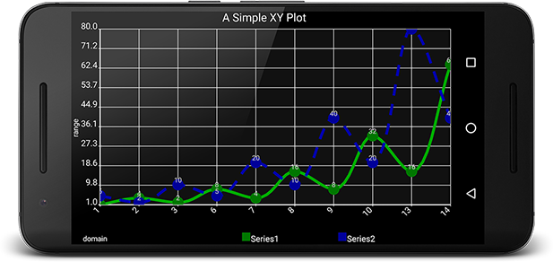

# Quickstart



This tutorial will walk you through Adding Androidplot as a dependency and displaying an XYPlot with 
two data series.  You can view this sample on your own device or emulator by installing the 
[Demo App](https://play.google.com/store/apps/details?id=com.androidplot.demos) on your device and 
clicking on the Simple XY Plot Example. Full source [available here](../demoapp/src/main/java/com/androidplot/demos/SimpleXYPlotActivity.java).

You can also watch this tutorial in video form on [Youtube](https://youtu.be/wEFkzQY_wWI).

# Add the Dependency
To use the library in your gradle project add the following to your build.gradle:

```groovy
dependencies {
    compile "com.androidplot:androidplot-core:1.5.7"
}
```

If you’re using Proguard obfuscation (Projects created by Android Studio do by default) you’ll also 
want add this to your proguard-rules.pro file:

`-keep class com.androidplot.** { *; }`

# Create your Activity XML Layout
Once you’ve got an Android project skeleton created, create **res/layout/simple_xy_plot_example.xml** 
and add an XYPlot view:
```xml
<LinearLayout xmlns:android="http://schemas.android.com/apk/res/android"
              xmlns:ap="http://schemas.android.com/apk/res-auto"
              android:layout_height="match_parent"
              android:layout_width="match_parent">

    <com.androidplot.xy.XYPlot
        style="@style/APDefacto.Dark"
        android:id="@+id/plot"
        android:layout_width="fill_parent"
        android:layout_height="fill_parent"
        ap:title="A Simple XY Plot"
        ap:rangeTitle="range"
        ap:domainTitle="domain"
        ap:lineLabels="left|bottom"
        ap:lineLabelRotationBottom="-45"/>
</LinearLayout>
```
This example uses a default style to decorate the plot.  The full list of XML styleable attributes is 
[available here](attrs.md).  While new attributes are added regularly,
not all configurable properties are yet available.  

If something you need is missing, use [Fig Syntax](https://github.com/halfhp/fig)
directly within your Plot's XML, prefixing each property with "androidPlot".  Example:

```xml
androidPlot.title="My Plot"
```

# Create an Activity
Now let's create an Activity to display the XYPlot we just defined in `simple_xy_plot_example.xml`.  
The basic steps are:

1. Create an instance of Series and populate it with data to be displayed.
2. Register one or more series with the plot instance along with a Formatter to describing how the series should look when drawn.
3. Draw the Plot

Since we're working with XY data, we’ll use XYPlot, SimpleXYSeries (which is an 
implementation of the XYSeries interface) and LineAndPointFormatter:

```java
import android.app.Activity;
import android.graphics.*;
import android.os.Bundle;

import com.androidplot.util.PixelUtils;
import com.androidplot.xy.SimpleXYSeries;
import com.androidplot.xy.XYSeries;
import com.androidplot.xy.*;

import java.text.FieldPosition;
import java.text.Format;
import java.text.ParsePosition;
import java.util.*;

/**
 * A simple XYPlot
 */
public class SimpleXYPlotActivity extends Activity {

    private XYPlot plot;

    @Override
    public void onCreate(Bundle savedInstanceState)
    {
        super.onCreate(savedInstanceState);
        setContentView(R.layout.simple_xy_plot_example);

        // initialize our XYPlot reference:
        plot = (XYPlot) findViewById(R.id.plot);

        // create a couple arrays of y-values to plot:
        final Number[] domainLabels = {1, 2, 3, 6, 7, 8, 9, 10, 13, 14};
        Number[] series1Numbers = {1, 4, 2, 8, 4, 16, 8, 32, 16, 64};
        Number[] series2Numbers = {5, 2, 10, 5, 20, 10, 40, 20, 80, 40};

        // turn the above arrays into XYSeries':
        // (Y_VALS_ONLY means use the element index as the x value)
        XYSeries series1 = new SimpleXYSeries(
                Arrays.asList(series1Numbers), SimpleXYSeries.ArrayFormat.Y_VALS_ONLY, "Series1");
        XYSeries series2 = new SimpleXYSeries(
                Arrays.asList(series2Numbers), SimpleXYSeries.ArrayFormat.Y_VALS_ONLY, "Series2");

        // create formatters to use for drawing a series using LineAndPointRenderer
        // and configure them from xml:
        LineAndPointFormatter series1Format =
                new LineAndPointFormatter(this, R.xml.line_point_formatter_with_labels);

        LineAndPointFormatter series2Format =
                new LineAndPointFormatter(this, R.xml.line_point_formatter_with_labels_2);

        // add an "dash" effect to the series2 line:
        series2Format.getLinePaint().setPathEffect(new DashPathEffect(new float[] {

                // always use DP when specifying pixel sizes, to keep things consistent across devices:
                PixelUtils.dpToPix(20),
                PixelUtils.dpToPix(15)}, 0));

        // just for fun, add some smoothing to the lines:
        // see: http://androidplot.com/smooth-curves-and-androidplot/
        series1Format.setInterpolationParams(
                new CatmullRomInterpolator.Params(10, CatmullRomInterpolator.Type.Centripetal));

        series2Format.setInterpolationParams(
                new CatmullRomInterpolator.Params(10, CatmullRomInterpolator.Type.Centripetal));

        // add a new series' to the xyplot:
        plot.addSeries(series1, series1Format);
        plot.addSeries(series2, series2Format);

        plot.getGraph().getLineLabelStyle(XYGraphWidget.Edge.BOTTOM).setFormat(new Format() {
            @Override
            public StringBuffer format(Object obj, StringBuffer toAppendTo, FieldPosition pos) {
                int i = Math.round(((Number) obj).floatValue());
                return toAppendTo.append(domainLabels[i]);
            }
            @Override
            public Object parseObject(String source, ParsePosition pos) {
                return null;
            }
        });
    }
}
```


One potentially confusing section of the code above are the initializations of LineAndPointFormatter   
You probably noticed that they take a mysterious reference to an xml resource file. This is actually 
using [Fig](https://github.com/halfhp/fig) to configure the instance properties from XML.  

If you'd prefer to avoid the XML and keep everything in Java, just replace the code:

```java
LineAndPointFormatter series1Format = 
    new LineAndPointFormatter(this, R.xml.line_point_formatter_with_labels);
```

with:

```java
LineAndPointFormatter series1Format = new LineAndPointFormatter(Color.RED, Color.GREEN, Color.BLUE, null);
```

In general XML configuration should be used over programmatic configuration when possible as it produces 
more flexibility in terms of defining properties by screen density etc..  For more details on how to 
programmatically configure Formatters etc. consult the latest Javadocs.

Continuing with the original example above, add these files to your **/res/xml** directory:

#### /res/xml/line_point_formatter_with_labels.xml
```xml
<?xml version="1.0" encoding="utf-8"?>
<config
    linePaint.strokeWidth="5dp"
    linePaint.color="#00AA00"
    vertexPaint.color="#007700"
    vertexPaint.strokeWidth="20dp"
    fillPaint.color="#00000000"
    pointLabelFormatter.textPaint.color="#CCCCCC"/>
```

#### /res/xml/line_point_formatter_with_labels_2.xml
```xml
<?xml version="1.0" encoding="utf-8"?>
<config
    linePaint.strokeWidth="5dp"
    linePaint.color="#0000AA"
    vertexPaint.strokeWidth="20dp"
    vertexPaint.color="#000099"
    fillPaint.color="#00000000"
    pointLabelFormatter.textPaint.color="#CCCCCC"/>
```

# Whats Next?
Learn about [Plot Composition](plot_composition.md) or continue with [XYPlots](xyplot.md).